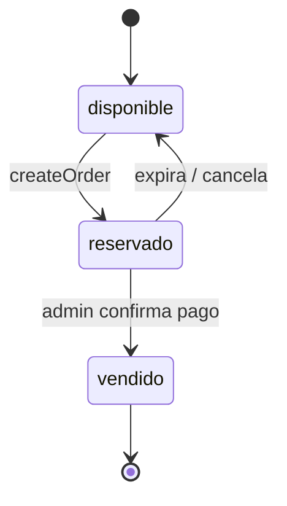

# WEB-RIFA — Firebase SDK y base de datos de rifas

Documento de referencia para el backend Firebase del módulo de rifa benéfica de **Vanessa Quirós** (`vanessa-quiros/`).

| Campo | Valor |
|-------|--------|
| **Proyecto Firebase** | `vanessaquiros-co` |
| **Consola** | [Firebase Console — vanessaquiros-co](https://console.firebase.google.com/project/vanessaquiros-co) |
| **Producto principal** | Cloud Firestore |
| **Frontend vinculado** | `vanessa-quiros/index.html` (rifa 1000 números, #000–#999) |
| **Moneda rifa** | Colones (₡) — `TICKET_PRICE = 2000` |
| **Moneda donaciones** | USD (sección `#donar`, independiente de rifa) |

---

## 1. Configuración del SDK (web-rifa)

> **Claves privadas:** no van en este documento ni en GitHub.  
> Ver [SECRETS.md](SECRETS.md) para configuración local y despliegue seguro.

### Archivos del SDK

| Archivo | Público en Git | Descripción |
|---------|----------------|-------------|
| `js/web-rifa/firebase-config.example.js` | Sí | Plantilla con placeholders |
| `js/web-rifa/firebase-config.js` | **No** (`.gitignore`) | Claves reales — solo local o CI |
| `js/web-rifa/firebase-init.js` | Sí | `initializeApp` + `getFirestore` |

### Setup local

```powershell
Copy-Item js\web-rifa\firebase-config.example.js js\web-rifa\firebase-config.js
# Editar firebase-config.js con valores de Firebase Console
```

### Ejemplo de estructura (sin claves reales)

```javascript
import { initializeApp } from "firebase/app";
import { getFirestore } from "firebase/firestore";
import { firebaseConfig } from "./firebase-config.js";

const app = initializeApp(firebaseConfig);
const db = getFirestore(app);
```

En producción (GitHub Pages), el workflow `.github/workflows/deploy-pages.yml` genera `firebase-config.js` desde **GitHub Secrets**. Detalle en [SECRETS.md](SECRETS.md).

### Productos Firebase a habilitar (próximos pasos)

| SDK | Uso en web-rifa |
|-----|-----------------|
| `firebase/firestore` | Estado de 1000 boletos + pedidos |
| `firebase/auth` | Panel admin (confirmar pagos SINPE) |
| `firebase/functions` | *(opcional)* Reserva atómica de boletos en servidor |

### Nota sobre el stack actual

El sitio es **HTML + JS vanilla sin bundler**. Para integrar el SDK hay dos caminos:

1. **`<script type="module">`** con imports desde CDN (`https://www.gstatic.com/firebasejs/10.x.x/...`).
2. Archivo dedicado `js/web-rifa/firebase-init.js` cargado como módulo desde `vanessa-quiros/index.html`.

No usar `npm`/Vite salvo que el proyecto migre a build step.

---

## 2. Modelo de datos Firestore

### Colección `tickets` (1000 documentos fijos)

Document ID = string del ID numérico (`"0"` … `"999"`).

```javascript
{
  id: 345,                    // number 0-999
  numero: "45",               // string "00"-"99"
  serieDigit: 3,              // number 0-9 (cuadrícula / primer dígito de serie JPS)
  status: "disponible",       // "disponible" | "reservado" | "vendido"
  orderId: null,              // string | null — pedido que reservó/vendió
  updatedAt: Timestamp
}
```

**Regla de negocio:** el ID real del boleto = `serieDigit * 100 + parseInt(numero)`.
- Tab 3 + número 45 → boleto **#345**
- Tab 0 + número 07 → boleto **#007**

**Estado `seleccionado`:** solo existe en el carrito del cliente (memoria local). **No** se persiste en Firestore.

### Colección `orders` (pedidos de rifa)

Document ID = auto-generado por Firestore.

```javascript
{
  nombre: "María Pérez",
  telefono: "8888-8888",
  instagram: "@usuario",
  boletos: [
    { id: 345, numero: "345" },
    { id: 122, numero: "122" }
  ],
  total: 4000,                // recalculado en servidor
  precioUnitario: 2000,
  status: "pendiente_pago",   // "pendiente_pago" | "pagado" | "cancelado" | "expirado"
  createdAt: Timestamp,
  paidAt: null,
  paymentRef: null            // referencia SINPE opcional
}
```

### Payload actual del frontend (punto de enganche)

En `vanessa-quiros/index.html`, al confirmar compra se genera:

```javascript
{
  nombre, telefono, instagram,
  boletos: [{ id, numero }],  // numero formateado 3 dígitos
  total,
  precioUnitario: 2000
}
```

Este objeto debe enviarse a Firestore (idealmente vía Cloud Function con transacción).

---

## 3. Flujo de estados

```text
disponible  →  reservado   (usuario confirma pedido, pendiente SINPE)
reservado   →  vendido     (admin confirma pago)
reservado   →  disponible  (expira tras 24-48 h sin pago)
```



---

## 4. Reglas de seguridad Firestore (borrador)

Publicar en Firebase Console → Firestore → Rules. **Ajustar antes de producción.**

```javascript
rules_version = '2';
service cloud.firestore {
  match /databases/{database}/documents {

    // Boletos: lectura pública del status; escritura restringida
    match /tickets/{ticketId} {
      allow read: if true;
      allow write: if false; // Solo Cloud Functions o admin autenticado
    }

    // Pedidos: crear solo vía Function; leer solo admin
    match /orders/{orderId} {
      allow read: if request.auth != null && request.auth.token.admin == true;
      allow create, update: if false; // Cloud Function createOrder / confirmPayment
    }
  }
}
```

> La `apiKey` del cliente es pública en apps web; la protección real está en **Security Rules** y **Cloud Functions**, no en ocultar la clave.

---

## 5. Funciones a implementar (web-rifa API)

| Función | Responsabilidad |
|---------|-----------------|
| `loadTickets()` | Cargar boletos no disponibles o los 1000 estados al iniciar rifa |
| `createOrder(payload)` | Transacción: validar boletos `disponible` → `reservado`, crear `orders` |
| `confirmPayment(orderId)` | Admin: `pendiente_pago` → `pagado`, boletos → `vendido` |
| `expireReservations()` | Scheduled: liberar `reservado` antiguos |

### Reemplazo en frontend

Sustituir en `vanessa-quiros/index.html`:

- `buildTickets()` + `seedVendidos()` → `loadTickets()` desde Firestore
- `console.log('[Rifa] Confirmación...')` → `await createOrder(payload)`

---

## 6. Estructura de archivos recomendada (fase integración)

```text
WebSite/
├── docs/
│   └── WEB-RIFA.md              ← este documento
├── js/
│   └── web-rifa/
│       ├── firebase-init.js     ← initializeApp + getFirestore
│       ├── tickets.js           ← loadTickets, listeners
│       └── orders.js            ← createOrder
└── vanessa-quiros/
    └── index.html               ← importar módulos web-rifa
```

---

## 7. Script de inicialización única (seed)

Ejecutar **una vez** (Cloud Function, script admin o consola) para crear los 1000 documentos en `tickets`:

```javascript
for (let id = 0; id < 1000; id++) {
  const serieDigit = Math.floor(id / 100);
  const numero = String(id % 100).padStart(2, '0');
  // setDoc(doc(db, 'tickets', String(id)), { id, numero, serieDigit, status: 'disponible', orderId: null, updatedAt: serverTimestamp() })
}
```

No volver a ejecutar si ya existen documentos (idempotencia).

---

## 8. Límites plan Spark (gratis)

- Firestore: ~50K lecturas / 20K escrituras por día
- Optimización: cargar solo `where('status', '!=', 'disponible')` o usar snapshot listener en cambios
- Cloud Functions: cuota mensual limitada; suficiente para reservas moderadas

---

## 9. Checklist de integración

- [ ] Firestore habilitado en proyecto `vanessaquiros-co`
- [ ] Colección `tickets` con 1000 docs
- [ ] Security Rules publicadas
- [ ] `createOrder` con transacción (Function recomendada)
- [ ] Frontend: quitar `seedVendidos()` simulado
- [ ] Panel admin para confirmar pagos SINPE
- [ ] Probar concurrencia (dos usuarios, mismo boleto)

---

## 10. Referencias

- [Firebase Web Setup](https://firebase.google.com/docs/web/setup)
- [Firestore Transactions](https://firebase.google.com/docs/firestore/manage-data/transactions)
- Frontend rifa: `vanessa-quiros/index.html` — secciones `// === TICKETS ===` y checkout form
- Push / deploy: `PUSH.md`

---

*Proyecto: VaneQuiros — módulo web-rifa · Firebase `vanessaquiros-co`*
